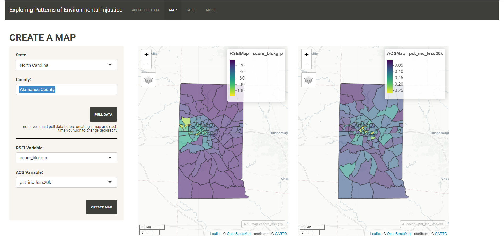
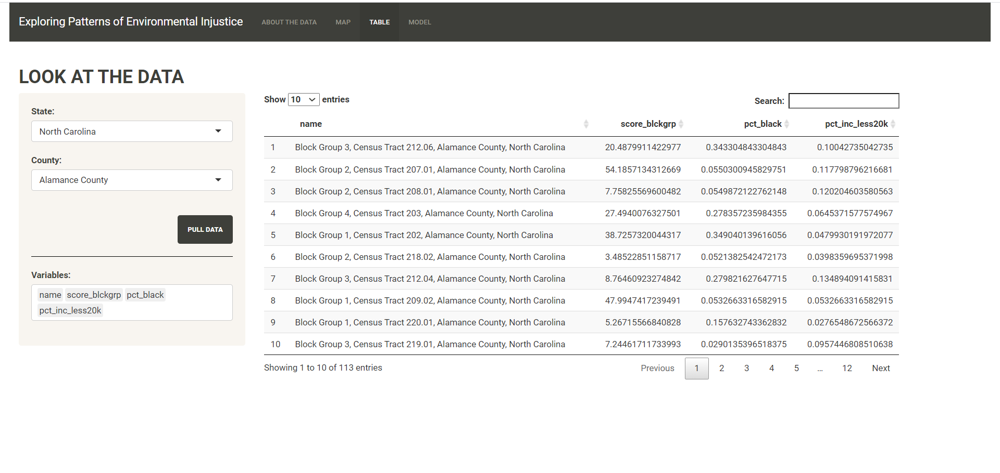
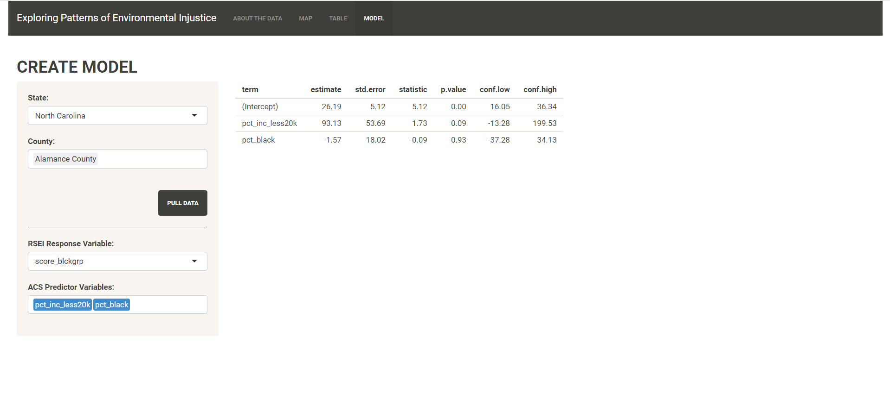

# Exploring Patterns of Environmental Injustice: Mapping Pollution, Race, and Income Data

Link to App: https://ryan-j-h.shinyapps.io/Explore-EJ/ 

## Introduction

Cases of environmental injustices frequently present as a minority or low-income 
population being disproportionately exposed to pollution or another 
environmental hazard.

This app aims to provide a simple tool with which one can begin to explore how 
pollution, as measured by the EPA's Risk Screening Environmental Indicators 
tool, may correspond with demographic characteristics of race and income, as 
measured by the American Community Survey.

This app was created as an individual project for STA 323: Statistical Programming
at Duke University during the Summer 2020 term.

## About the App

Read more about the data and the variables used on the app's homepage at 
https://ryan-j-h.shinyapps.io/Explore-EJ/.

### Map

The Map tab allows users to create side by side maps to see if block groups with 
particularly high RSEI scores or toxicity concentrations coincide with block 
groups that have lower incomes or a higher proportion of minorities. Users 
should look for areas that are light (yellow) on both maps.

Users may choose one or many counties to look at, as long as all are in the same 
state.

### Table

The Table tab allows users to take a look at the data, by selecting the 
variables they wish to see.

Users may choose one or many counties to look at, as long as all are in the same 
state.

### Model

The Model tab allows users to run OLS regressions to explore whether any 
relationships between exposure and demographic characteristics are 
statistically significant.

Users may choose one or many counties in these calculations, as long as all are 
in the same state.

## GitHub Workflow

RSEI data were downloaded and read in locally using the scripts 
`read-aggr-rsei-microdata.R` and `read-gridblock-xwalks.R` due to their large 
sizes. Links are provided at the top of the files for replication. RSEI data
were processed using `wrangle-rsei-xwalk.R`, using calculations as described at
https://ryan-j-h.shinyapps.io/Explore-EJ/ to convert the geography of RSEI data 
from their original 810 x 810 m grid to block group level.

ACS data are pulled from the Census API using the `tidycensus` package upon 
request in any one of the tabs of the app.

## References

RSEI:

https://www.epa.gov/rsei/ways-get-rsei-results

https://www.epa.gov/sites/production/files/2016-03/documents/rsei-data-dictionary-v234.pdf

https://www.epa.gov/sites/production/files/2014-03/documents/rsei_methodology_v2_3_2.pdf

https://www.epa.gov/rsei/understanding-rsei-results

Inspiration:

https://oehha.ca.gov/calenviroscreen/report/calenviroscreen-30

https://www.enviro-lawyer.com/EJTools.html

http://www.justicemap.org/index.php

Coding:

https://sites.temple.edu/psmgis/2017/07/26/r-shiny-task-create-an-input-select-box-that-is-dependent-on-a-previous-input-choice/
